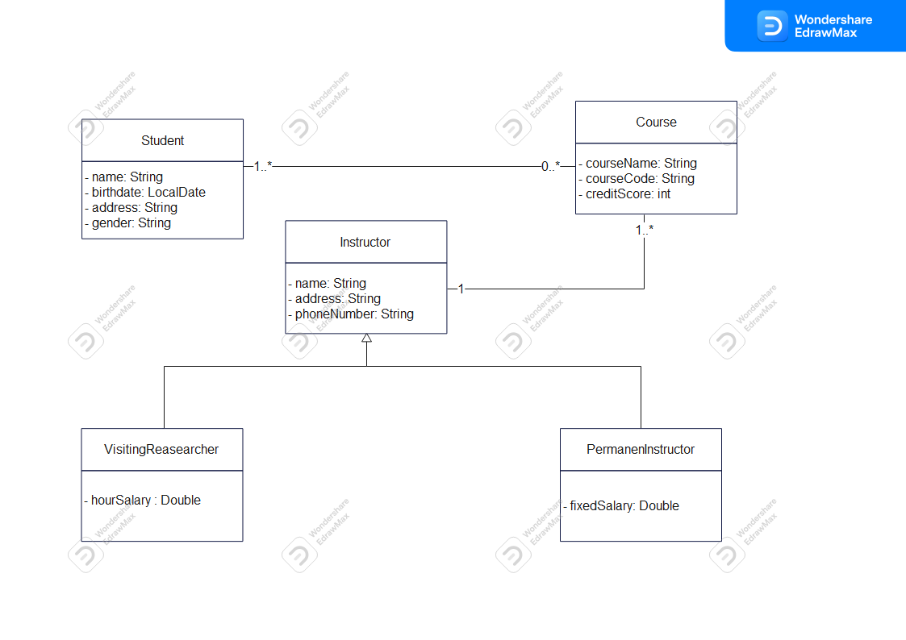

#WFP Java Bootcamp Homework 02
--
This is basic Java application implements School Management System.

I used hibernate and MySQL in this project.

Features:

- A Student could take zero or more courses.

- Instructors could instruct at least one or more courses.

- A course could be instructed by only one instructor.

It does not implement cardinality in the code, but you can show the cardinality on the uml diagram.

It does some basic CRUD processes, and it is designed based on the MVC model.

